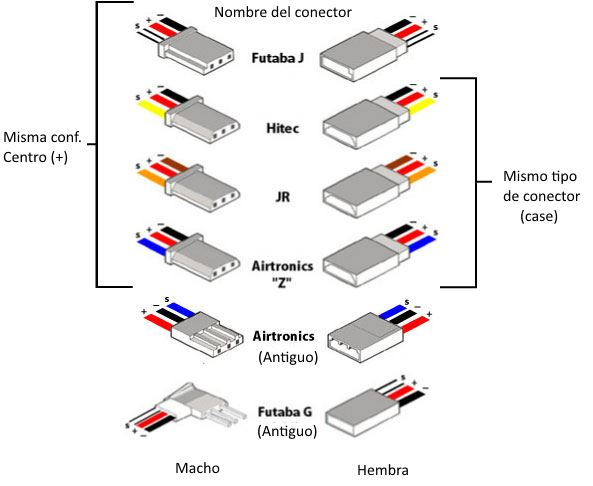

# RCSG 2

* Radio Control Standard Group
* M. Sigueros 
* Petición de comentarios: 2
* Febrero 2016

## Instalación de servos
### Estado de este memo
Este documento es un borrador de información relevante.

### Abstracto
Con el fin de facilitar el movimiento de partes de un ingenio de radio control es necesario un elemento que facilite el movimiento de dichas partes de manera mecánica y con el uso de la electricidad.

Lista de contenidos

1. [Introducción](#01)
2. [Conexionado de los servos](#02)

### Introducción
Los servos son unos componentes electromecánicos que facilitan el movimiento de partes móviles de un ingenio radio control. Hay de bastantes tipos y formas aunque casi todos tienen los mismos principios. Normalmente un servo es una pieza cuadrada que tiene un rotor y un eje, al cual se conecta una pequeña pieza a modo de extensor para poder enganchar posteriormente un elemento rígido conectado a su vez con la superficie de control o parte móvil. Habitualmente se pueden mover en un radio de 180º aunque los hay que admiten otros radios de giros, incluso giro sin fin. Se puede consultar algo mas de información sobre los dispositivos servo de la empresa Futaba Corp en la patente [US7284457B2](https://patents.google.com/patent/US7284457B2/en)

### Conexionado de los servos
Las conexiones de los servos son uno de los mayores problemas que podemos encontrar a la hora de intentar realizar un montaje. Podemos encontrar distintos colores de cable. Sin embargo a pesar de ello el funcionamiento del servo sigue siendo el mismo ya que está estandarizado. 

Por tanto vamos a detallar los colores y conexiones de cada tipo de servo.

Fig.1

En conocimiento de lo visible en la Fig.1 se propone el uso de los conectores de tipo *case* en cualquier montaje para facilitar su compatibilidad con los distintos sistemas.